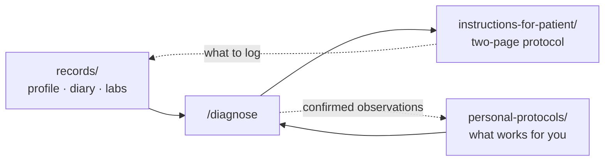

<div align="center">

# open-health

**Your health in plain markdown, with Claude as the analyst who has actually read your file.**


</div>

Your doctor gets ten minutes and none of your history. A chatbot gets one message and none of
your history. This repo gives Claude all of it: your profile, labs, food diary, and the rules
you've learned about your own body. Claude works through it the way a careful clinician would:
ranked hypotheses with probabilities, the questions that tell them apart, and a two-page plan
you can take to your GP.

## Start in three steps

1. **Use this template → Private repository.** It will hold your health data. Don't fork it:
   a fork of a public repo is public too.
2. Clone it, `cd` in, run `claude`.
3. Type **`/onboard`**. Claude interviews you and fills your profile. After that, just talk.

## What to type

| You type | You get |
| --- | --- |
| `/diagnose headache every afternoon this week` | Ranked hypotheses with %, 3–5 questions that tell them apart, updated odds after each answer |
| `/log` + a lab PDF or screenshot | A dated lab file with values and ranges, plus a row in the labs index |
| `/log lunch burger and fries, loose stool an hour later` | A timestamped diary line |
| `/protocol` | A two-page plan: tests to ask for, doses, rules, products, red flags |
| Any health question | An answer grounded in your own data, with the evidence graded |

## How it fits together



```
records/                      raw facts, append-only
  general-info-on-patient.md    your profile: sets the priors
  food-diary.md                 what you ate, how you felt
  labs/                         one file per test date
personal-protocols/           what works for you: rules and reaction ledgers
instructions-for-patient/     protocols Claude writes for you to follow
.claude/skills/               /onboard · /log · /diagnose · /protocol
CLAUDE.md                     house rules: dates, language, evidence, delegation
```

Every file is plain markdown. Edit by hand whenever you like; Claude keeps to the same layout.

## Why it works

- **The starting odds come from your data.** Every answer starts from your profile, labs and
  history. A test you already passed lowers a hypothesis instead of being ordered again.
- **Probabilities, not vibes.** A diagnosis comes as a ranked table that updates with each
  answer. It stops when one cause clearly leads or only a test can decide.
- **Evidence is graded.** Answers name the mechanism, the consensus and the trial size, and call
  weak evidence weak. Forum tips are labelled anecdotal and kept separate.
- **Nothing made up.** Product links are checked to open and be in stock before they're
  recommended. Every fact carries an absolute date.
- **Your files, your repo.** Web lookups run in subagents and never include your name or
  identifying details.

> **Not medical advice.** This is a tool for thinking, and for better conversations with your
> doctor, not a replacement for one. If something on a red-flag list happens, go to a doctor
> now instead of opening the terminal.

[MIT](LICENSE)
